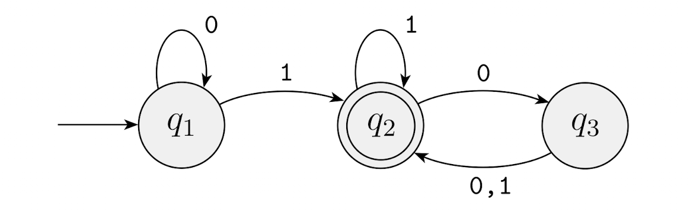
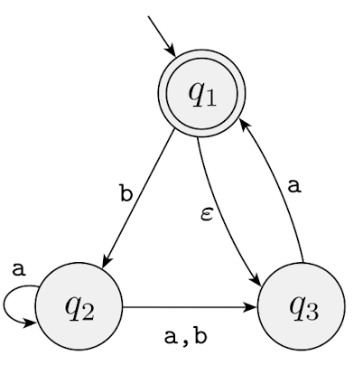

## 1. Finite Automata
> 유한한 상태에서 현재 상태와 입력에 따라 상태를 전환.
> 메모리 (추가 저장 공간)를 사용하지 않음
> **정규 언어(regular language)를 계산할 수 있음**
> 출력은 accept or reject 둘 중에 하나임

### Deterministic Finite Automaton (DFA - 결정적 유한 기계)
>정의: M = (Q, $\Sigma$, $\sigma$, $q_0$, F)
 * Q : finite set of states
 * $\Sigma$ : input finite alphabet symbol
 * $\sigma$ : transition function
 * $q_0$ : initial state
 * F : set of final states
>example) $M_1$ = (Q, $\Sigma$, $\sigma$, $q_1$, F)
>Q = {$q_1, q_2, q_3$}
>$\Sigma=\{0, 1\}$
>$\sigma$ = $Q \times \Sigma \rightarrow Q$
>F = {$q_2$}

만약 A라는 집합의 모든 문자열들이 머신을 통해 모두 accept 된다면, 집합 A는 해당 머신의 언어라고 할 수 있고, L($M_1$) = A라고 표기한다. 또한, **$M_1$ recognizes A** 라고 할 수 있다.
하지만 recognize와 accept을 헷갈릴 수 있다!
*주어진 집합의 모든 내용이 accept가 되어야지 recognize라고 할 수 있다.*

이런 Finite Automaton에서 recongnize한 language(집합A와 같은)를 **regular language(정규언어)**라고 한다.

### The Regular Operations
앞서 우리는 finite automata와 regular languages를 정의해봤다. 이제 우리는 그것들의 속성을 조사해볼 것이다. 기본적인 연산에서 *기본 객체 = 숫자, 도구 = 연산자 (+, x)* 이다.
근데 계산이론에서는 *기본객체 = 언어, 도구 = 그것들을 조작하기위한 특정 연산자*
우리는 언어에서 3가지 연산를 정의 할 것인데 이를 regular operations라고 불를 것이다.
> DEFINITION 1.23
> Let A and B be languages. We deine the regular operations ***union, concatenation, and star***
> - Union: $A \cup B = \{x\ |\ x \in A or x \in B\}$
> - Concatenation:  $A \cup B = \{x\ |\ x \in A or x \in B\}$
> - Star: $A^* = \{x_1x_2...x_k\ | \ k >= 0\ and\ each\ x_i\in A\}$

**Union**은 간단하게 A와 B 모든 문자열을 합쳐 하나의 언어로 만드는 작업
**Concatenation**은 A에 있는 문자열을 B에 있는 문자열 앞에 붙이는 모든 가능한 방법으로 새로운 문자열 생성
**Star**은 하나의 언어에 적용. 따라서 단항 연산. A에 있는 문자열들을 임의의 개수만큼 결합하여 새로운 언어의 문자열을 생성. 여기서 임의의 개수 0도 포함 -> 공백 문자열 $\epsilon$ 도 포함

모든 regular languages는 위의 3개의 regular operations에 대해 닫혀있다.
### Nondeterministic Finite Automaton (NFA - 비결정적 유한 기계)
>DEFINITION 1.37 : M = (Q, $\Sigma$, $\sigma$, $q_0$, F)
> * Q : finite set of states
> * $\Sigma$ : input finite alphabet symbol
> * $\sigma$ : $Q \times \Sigma_\epsilon \rightarrow P(Q)$ transition function
> * $q_0$ : initial state
> * F : set of final states
transition function은 $\Sigma$에 $\epsilon$을 포함하고 Q의 멱집합으로 이동할 수 있다.

NFA의 장점은 좀 더 간단하게 상태 다이어그램을 표현할 수 있다.

하지만 모든 NFA는 DFA로 바꿀수 있고 DFA도 NFA로 바꿀 수 있다. (NFA = DFA 동치관계) - 증명생략

### Regular Expression
> DEFINITION 1.52
> regular expression = R
> 1. a for soma a in the alphabet $\Sigma$
> 2. $\epsilon$
> 3. $\emptyset$
> 5. $(R_1 \cup R_2)$, where $R_1$ and $R_2$ are regular expressions
> 6. $(R_1 \cdot R_2)$, where $R_1$ and $R_2$ are regular expressions
> 7. $(R_1^*)$, where $R_1$ is regular expression.

Regular Expression과 FA는 동일한 표현력을 가진다.
모든 RE은 그것이 기술하는 언어를 인식하는 FA로 변환할 수 있고, FA도 RE으로 변환할 수 있다. - 증명 생략
